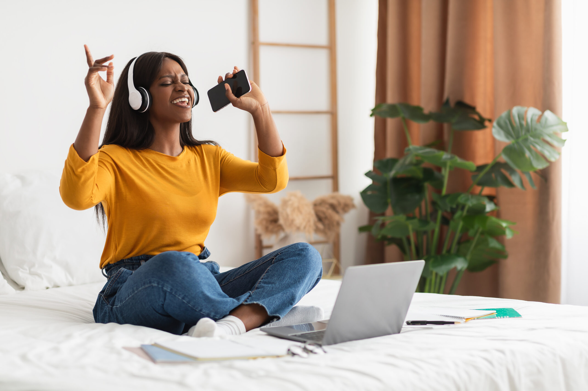

# My Favorite Activity
## Summary
Singing is totally my all-time favorite activity. I could spend hours just humming away to my favorite tunes or having a wild karaoke session at 2 in the morning, right in my own room. Let's not forget those epic shower concerts! Sometimes, I get lost watching my favorite singers, singing along like there's no tomorrow. Learning basic vocal techniques from YouTube is also enjoying to me.

## Reasons why I ❤️ singing
- I feel **free** and **positive** when I emerge in music.
- It’s an effective **stress relief** after long hours of work.
- I find my inner **creativity** is fully **nourished**. 

